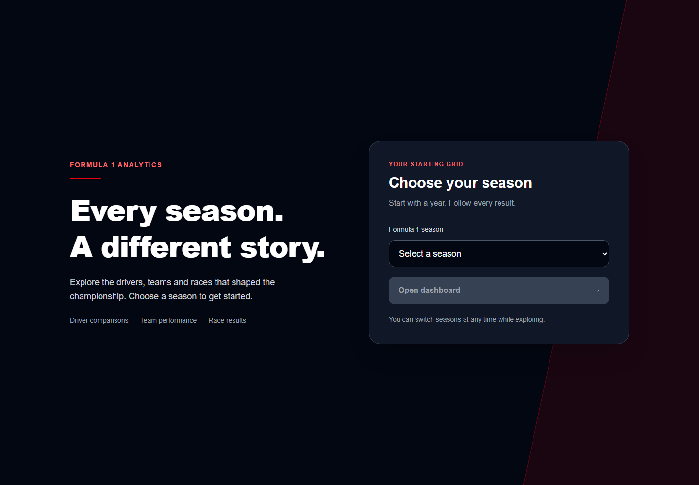
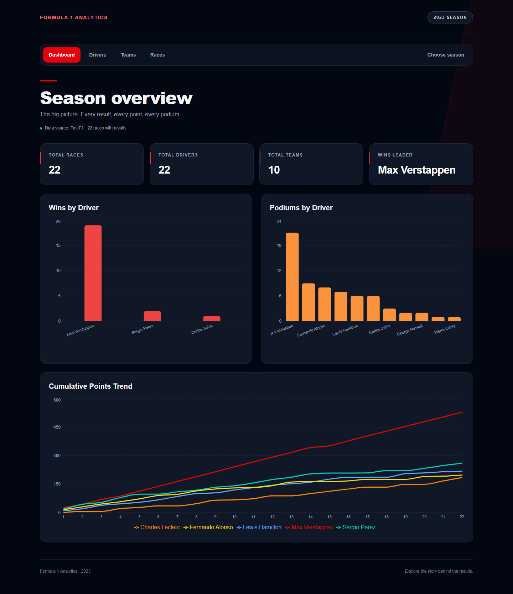
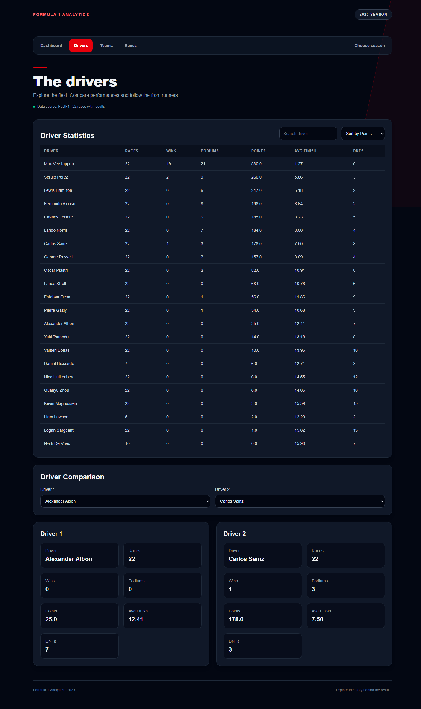
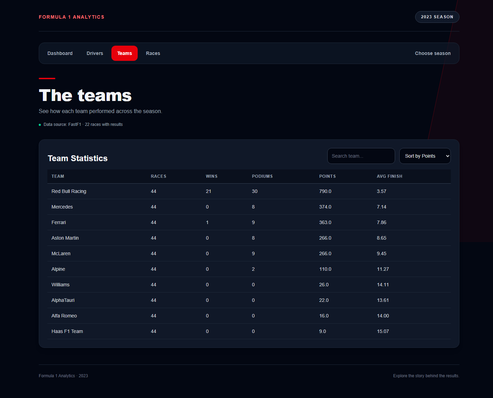
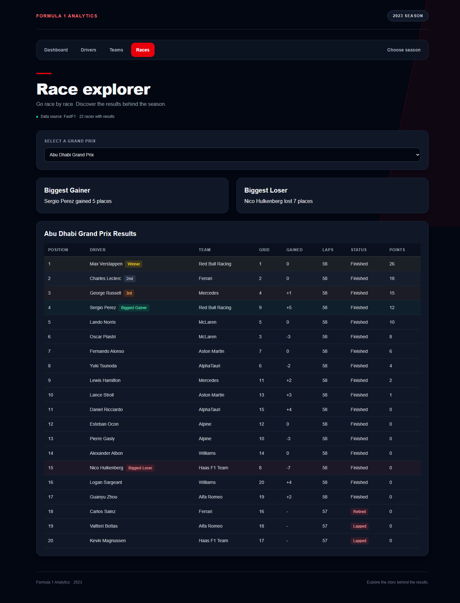
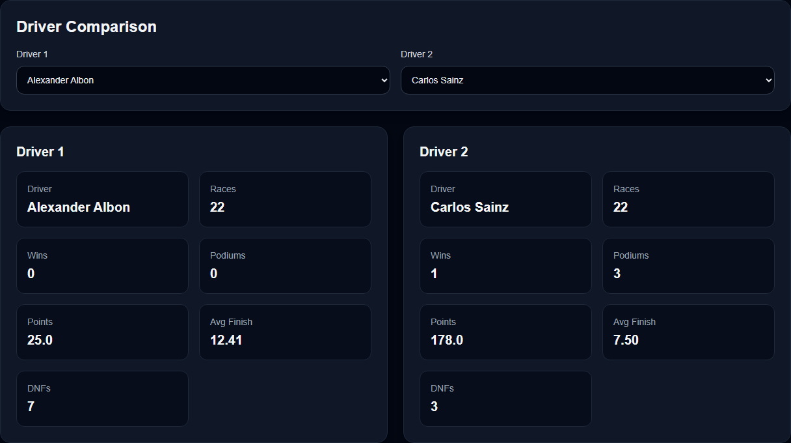
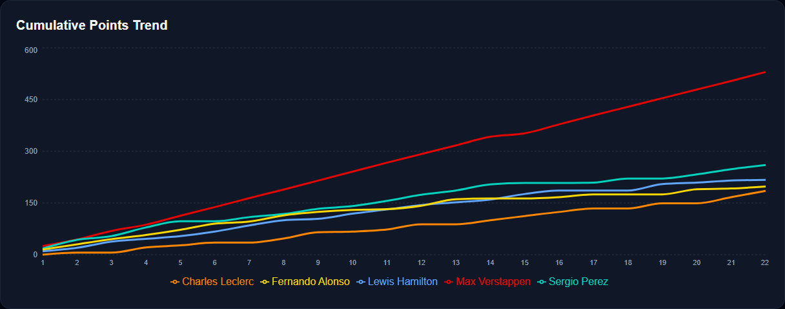

# 🏎️ Formula 1 Analytics Dashboard

A full-stack web application for exploring and analysing Formula 1 race data using real-world datasets.

Built with **FastAPI** (backend) and **React + Vite** (frontend), the dashboard provides interactive statistics, race analysis, driver comparisons, team performance, and data visualisations across Formula 1 seasons from 2018 onwards.

---

# 🌐 Live Demo

🚧 **A live demo is coming soon.**

Until then, you can run the project locally using the setup instructions below.

**GitHub Repository**

https://github.com/JamesWicks01/Formula1-Analytics-Dashboard

---

# 🚀 Features

## 📊 Dashboard

- Season overview
- Total races, drivers and teams
- Wins leaderboard
- Podiums leaderboard
- Cumulative points trend chart
- Season selector

---

## 👨‍🏎️ Drivers Page

- Driver statistics table
  - Races
  - Wins
  - Podiums
  - Points
  - Average finishing position
  - DNFs
- Search drivers
- Sort by:
  - Points
  - Wins
  - Podiums
  - DNFs
  - Name
- Driver comparison tool
- Multi-line cumulative points trend chart
- Individual driver colours on charts

---

## 🏁 Teams Page

- Team statistics table
- Total races
- Wins
- Podiums
- Championship points
- Average finishing position
- Search
- Sorting

---

## 🏎️ Race Explorer

- Browse every race in the season
- Interactive race selector
- Full classified race results
- Positions gained (Grid → Finish)
- DNFs automatically moved below classified finishers
- Unclassified drivers ordered by laps completed
- Race summary cards
  - Biggest Gainer
  - Biggest Loser
- Driver highlights
  - 🥇 Winner
  - 🥈 Second Place
  - 🥉 Third Place
  - 🟢 Biggest Gainer
  - 🔴 Biggest Loser

---

# 🧠 Backend (FastAPI)

## Features

- REST API
- FastF1 schedules and race results, with automatic CSV fallback
- Dataset cleaning and normalisation
- Driver statistics
- Team statistics
- Race results
- Driver comparison
- Analytics
  - Wins
  - Podiums
  - Points Trend

## Tech Stack

- Python
- FastAPI
- Pandas

---

# 🎨 Frontend (React)

## Features

- Multi-page application
- React Router
- Responsive interface
- Reusable components
  - Layout
  - Navigation Bar
  - Stat Cards
  - Charts
  - Loading States
  - Error States
- Interactive charts powered by Recharts
  - Wins Leaderboard
  - Podiums Leaderboard
  - Cumulative Points Trend

## Tech Stack

- React
- Vite
- Tailwind CSS
- Recharts

---

# 📁 Project Structure

```text
Formula1-Analytics-Dashboard/
│
├── backend/
│   ├── app/
│   │   ├── main.py                  # FastAPI application
│   │   ├── models/                  # Pydantic models
│   │   └── services/
│   │       ├── cleaner.py           # Dataset cleaning
│   │       ├── loader.py            # CSV loading
│   │       ├── metrics.py           # Analytics calculations
│   │
│   ├── data/
│   ├── requirements.txt
│   └── README.md
│
├── frontend/
│   ├── public/
│   ├── src/
│   │   ├── api/
│   │   ├── components/
│   │   ├── pages/
│   │   ├── App.jsx
│   │   └── main.jsx
│   │
│   ├── package.json
│   └── vite.config.js
│
├── .gitignore
├── LICENSE
└── README.md
```

---

# 📋 Requirements

Before running the project, ensure the following software is installed:

- Python **3.10** or later
- Node.js **18** or later (includes npm)
- Git

Verify your installation:

```bash
python --version
node --version
npm --version
git --version
```

---

# ⚙️ Setup

## Automatic Setup and Start (Windows PowerShell)

From the project root, install dependencies once, then start the application:

```powershell
.\setup.ps1
.\start.ps1
```

The launcher runs the backend from `backend/` and the frontend from `frontend/`.
Open http://localhost:5173 for the dashboard; the API runs at http://127.0.0.1:8000.
Keep the terminal open and press **Ctrl+C** to stop both servers.
For subsequent launches, only run `.\start.ps1`.

## Manual Setup and Start

Use two terminals, starting each from the project root.

### 1. Backend

In the first terminal, install the backend dependencies and start the API:

```bash
cd backend
python -m pip install -r requirements.txt
python -m uvicorn app.main:app --reload
```

Backend runs at:

```
http://127.0.0.1:8000
```

---

### 2. Frontend

In the second terminal, install the frontend dependencies and start the dashboard:

```bash
cd frontend
npm install
npm run dev
```

Frontend runs at:

```
http://localhost:5173
```

For subsequent launches, skip the install commands and run the start command in
each folder: `python -m uvicorn app.main:app --reload` in `backend/` and
`npm run dev` in `frontend/`. Press **Ctrl+C** in each terminal to stop its server.

---

# 📡 API Endpoints

```text
GET /api/seasons

GET /api/season/{year}/overview

GET /api/season/{year}/drivers

GET /api/season/{year}/drivers/stats

GET /api/season/{year}/drivers/compare

GET /api/season/{year}/teams/stats

GET /api/season/{year}/races

GET /api/season/{year}/races/{race_name}

GET /api/season/{year}/analytics/wins

GET /api/season/{year}/analytics/podiums

GET /api/season/{year}/analytics/points-trend
```

---

# 📌 Data Source

The bundled CSV fallback datasets are from:

https://github.com/toUpperCase78/formula1-datasets

**FastF1 is now the primary source** for season schedules and Grand Prix results.
The selector supports 2018 through the current year. The bundled 2023 CSVs are
used automatically when FastF1 fails or a completed race has incomplete results.
Fallback is selected for the entire season so totals never silently omit a failed
round. Other seasons need matching CSV files in `backend/data/raw/` to work offline.

FastF1's disk cache defaults to `backend/data/cache/fastf1/`, created automatically
and excluded from Git. Set `FASTF1_CACHE_DIR` before starting the backend to use a
different writable location. Each process also caches normalized seasons for one
hour; fallback and unavailable responses are retried on the next request after
60 seconds. Concurrent requests for a season share one load. The first load may
take several minutes; subsequent requests reuse the cache.

Every page shows the active source and number of races with results. A season
without FastF1 data or usable CSVs returns HTTP 503 with a readable error and
`Retry-After: 60`. Unsupported years return HTTP 404. New endpoints:

```text
GET /api/season/{year}/schedule
GET /api/season/{year}/status
```

Only races starting at least four hours ago are requested. Future races remain
in the schedule. This is a results dashboard, not a live timing service. Existing
points statistics remain Grand Prix race points; they exclude sprint points and
should not be interpreted as official championship standings. FastF1 qualifying,
sprint and driver-of-the-day enrichment is outside this phase.

### Phase 1 verification

FastF1 3.8.3 was installed in the development environment. To install on another
machine, use `python -m pip install -r backend/requirements.txt`.

```powershell
cd backend
python -m pip install -r requirements-dev.txt
python -B -m unittest discover -s tests -v
cd ../frontend
npm run lint
npm run build
```

The offline tests cover normalization, schedule filtering, cache isolation and
expiry, concurrent requests, unavailable data, unsupported seasons, and the API
contracts used by Dashboard, Drivers (including comparison), Teams and Race
Explorer with both FastF1 fixtures and the bundled CSV fallback.

---

# 📸 Screenshots

The redesigned interface, shown with the 2023 season.

## Welcome and season selection



## Dashboard



## Drivers



## Teams



## Race Explorer



## Driver comparison



## Cumulative points trend



---

# 🏁 Summary

This project demonstrates:

- Full-stack software development
- REST API development with FastAPI
- Data processing using Pandas
- Interactive user interfaces with React
- Responsive design with Tailwind CSS
- Data visualisation using Recharts
- Modern frontend and backend architecture
